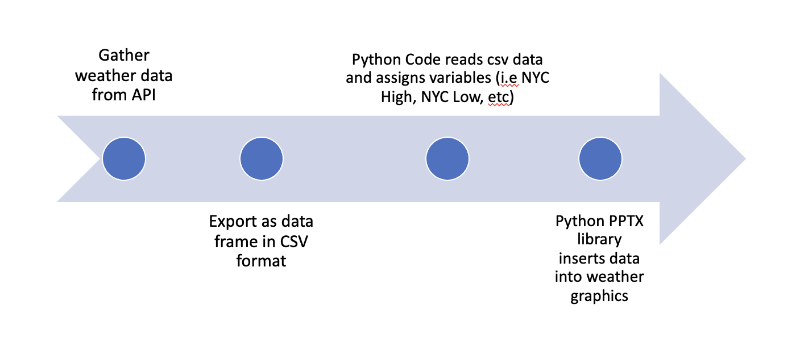
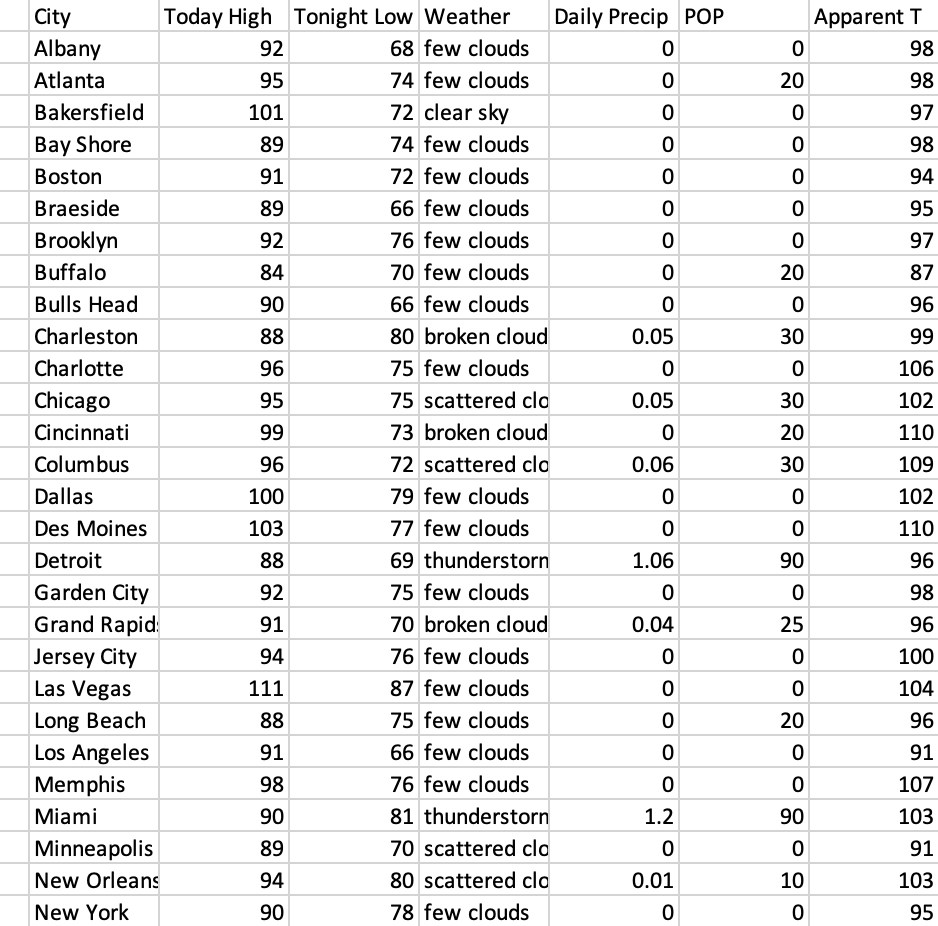
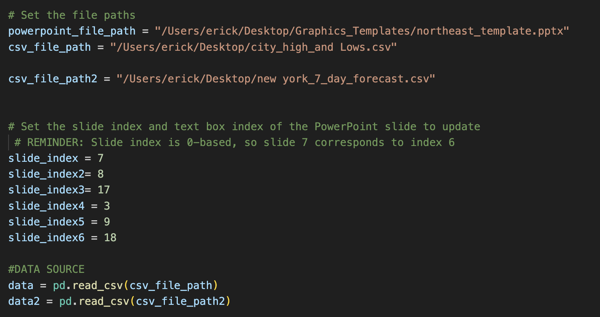
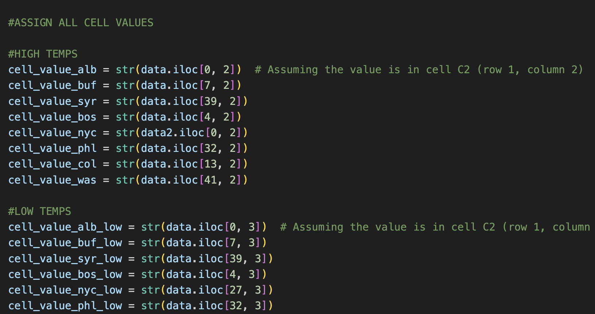
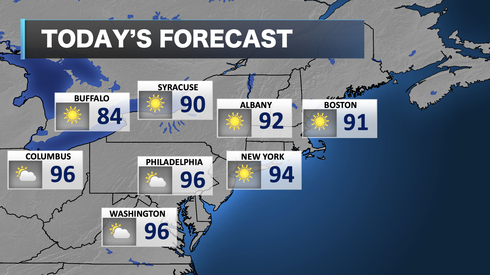

# WeatherWithErick - How it Works

This set of python code gathers weather data, organizes it into CSV files that be easily used in multiple programs, then fills that data on specific weather graphics placed in PowerPoint.

This code allows someone to quickly fill in weather information for dozens of cities with realiable weather data. The user can later adjust the numbers or weather icons if needed.

Here is an example of a CSV file produced from Weather API, cleaned and transformed with python.

Since PPTX easily allows someone to replace text boxes with CSV data in powerpoint, this was used to produce weather graphics. The process begins with identifying the powerpoint file name and path. Within the python code, slides must be assigned an index so that the code can idenify which slide is being updated. After assigning variables to the data text box elements are selected, the current input is replaced and the new data is inserted.

Here is a sample of the code:

The end result is quite amazing and simplistic. These graphics can be updated in seconds thanks to automated python code.

It should be noted that a powerpoint file is used as a template. An updated file is then the output for every set of graphics. There's a very good reason this is done. 

The process of replacing data changes the object index reference. For example, object 1 may become object 5 after the other 4 objects were changed on that slide. This makes the object reference a moving target every time the program is run. This is not a sustainable model. Therefore, a template is used to keep the index references for all text boxes the same. The output, which is a new file, is never used again but can be overwritten as a output the next time the program is run. 

Weather icons are replaced using image mapping. Unlike text boxesm which use index referencing, weather icons are named in the template (i.e nyc_icon). PPTX will search for the icon and then will direct the replacement of the icon with whatever the weather conditions are assigned to that variable.

